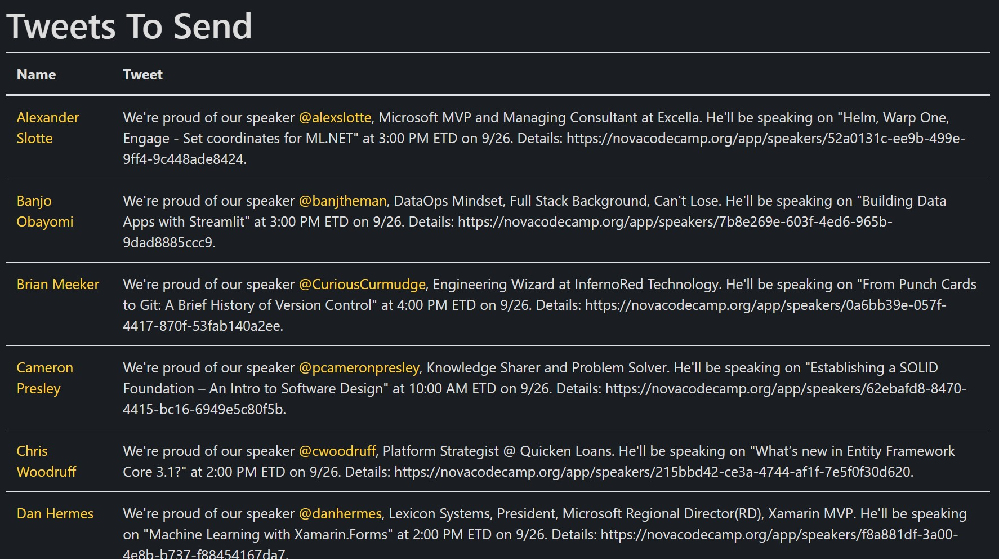
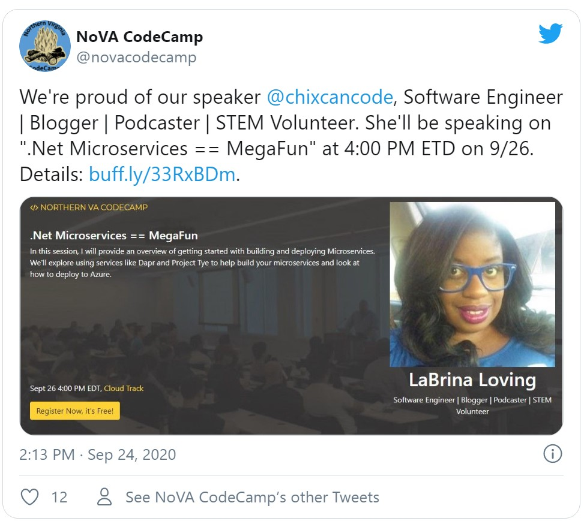
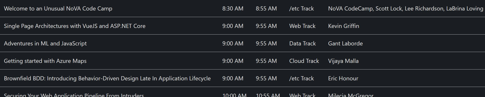
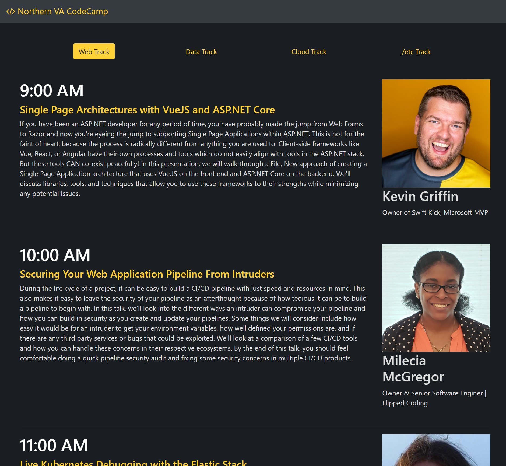
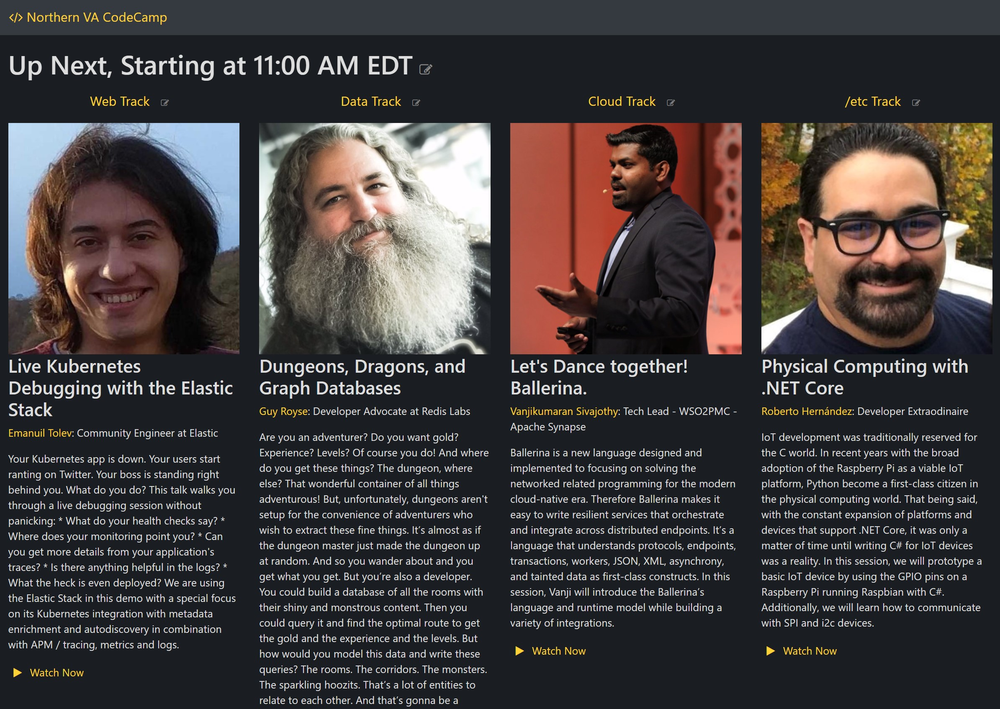
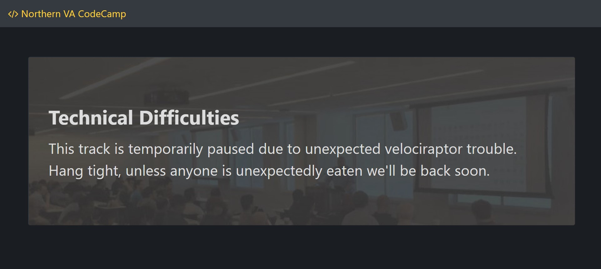

# Sessionized

Sessionized is a Single Page Application (SPA) tool for organizers of Code Camps (or similar conferences).  It consumes [Sessionize](https://sessionize.com/) data and provides the following features:

## Speaker Cards

It generates a page per speaker that can be used as "Speaker cards" for marketing on social media with session description, speaker bio, large speaker pics, a registration link and/or "Watch Now" links.

## Twitter Templating

It generates a page to help generate tweets with session title's, speaker twitter handles, and links to speaker cards

When combined with a screenshot of the speaker page tweets become engaging and speakers can retweet to help market your event.

## Export Page

It provides organizers with an "Export Page" for exporting all session and speaker data to Excel e.g. to help with analytics.

## Attendee Site

A web app with views per track and per time that they can navigate to help find their next session.

## Moderator Site

Moderators can use the same site that attendees use except with a click they can show "Up Next" or "Happening Now" screens that they can show between sessions to keep attendees engaged.

## Transition Screens

Moderators can get to branded "Transition Screens" page they can show if there are technical difficulties, are out to lunch, etc

## Customizability

The app is designed to be easily branded for different CodeCamps, and easily host-able via Github pages.  Customizing the app will require a cursory knowledge of Angular.

# Getting Started

1. Clone this repo
2. Create an API in Sessionize (under API / Embed)
    - Format: Json (advanced)
    - Include all sessions and speakers
3. Update API URL in `src/app/sessionize-service.service.ts`
4. Customize other elements
    - Update `src/app/no-va-nav/no-va-nav.component.html` to change the banner and branding
    - Add in a registration url to `src/app/watch-now.service.ts` so it shows up in speaker cards
    - Customize gender service in `src/app/watch-now.service.ts`
    - Optionally update `src/app/watch-now.service.ts` with your "Watch Now" url's (once you have them)
    - Optionally update theming (e.g. `$highlight-color`) in `styles.scss`
5. Install prerequisites
    - [Node](https://nodejs.org/en/)
    - [Angular](https://angular.io/guide/setup-local) (`npm install -g @angular/cli`)
6. Run it with `ng serve`
7. Deploy it with `ng build --prod --aot`
8. Publish the `/dist` folder to your website
